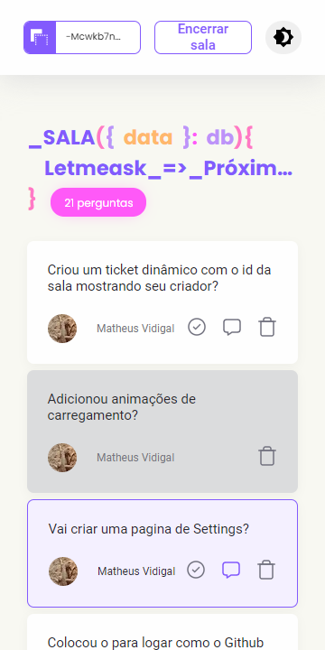
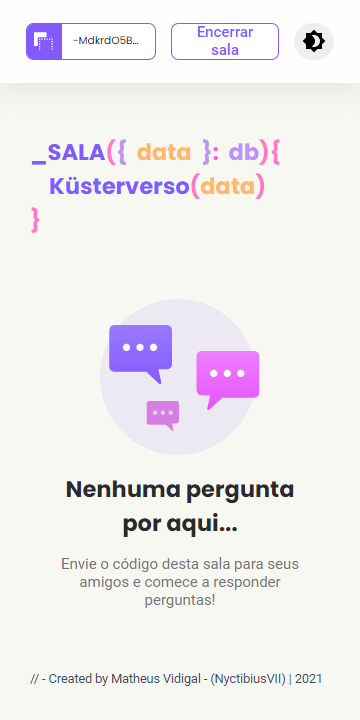
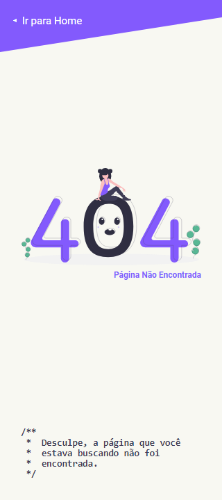

# IMGS
##### Mobile Screenshot

 

## Mobile Screenshot

<!-- Responsive, 320 x 720, 75% (Mobile L - 320px)-->
    
    
    
    
    
    
    
    
    
    
    

<!-- IMGS
    ------------------------------------------
    home
    home-enter-this-room
    ------------------------------------------
    createRoom
    ------------------------------------------
    admin-roomQA-with-questions
    admin-roomQA-without-questions
    user-roomQA-with-questions
    user-roomQA-without-questions
    ------------------------------------------
    modal-close-room
    modal-delete-question
    ------------------------------------------
    settings
    not-found-404
    ------------------------------------------
-->