<h1 align="center">
    <br>
    
</h1>
<h4 align="center">
    Trilha ReactJS 
</h4>
<!-- <h4 align="center">Projeto web construído durante o Next Level Week #06-Together com a Rocketseat/DiegoFernandes.</h4> -->
<p align="center">
    
    <a aria-label="Completado" href="https://nextlevelweek.com/episodios/react/aula-5/edicao/6">
        </img>
    </a>
    
    <a href="https://github.com/NyctibiusVII/Letmeask/blob/main/LICENSE">
        
    </a>
    <a href="https://picpay.me/Matheus_nyctibius_vii">
        
    </a>
</p>
<p align="center">
    <a href="#Letmeask-">Projeto</a>&nbsp;&nbsp;&nbsp;|&nbsp;&nbsp;&nbsp;
    <a href="#tecnologias-">Tecnologias</a>&nbsp;&nbsp;&nbsp;|&nbsp;&nbsp;&nbsp;
    <a href="#layout-">Layout</a>&nbsp;&nbsp;&nbsp;|&nbsp;&nbsp;&nbsp;
    <a href="#licença-%EF%B8%8F">Licença</a>
</p>
<!--
<p align="center">
    <a href="README.md">Inglês</a>
    ·
    <a href="README-pt.md">Português</a>
</p>
-->

# Letmeask 
Projeto desenvolvido para gerenciar perguntas, fazer perguntas em real-time com funcionalidade de votação. Projeto realizado na Next Level Week #6 (together) @Rocketseat.

#### Funcionalidades
* Gerenciar perguntas.
* Real-time.
* Login com Google e Github.
* Modal Cookies consent.
* Firebase.
* Site responsivo.

<details>
    <summary>Desafios</summary>

```
✔ - Documentar bem o projeto
✔ - Melhorar o estilo: Responsividade e Design
✖ - Bloquear funcionalidades se não estiver logado
✖ - Banco de dados
✖ - Next PWA

Funcionalidades:
    - Trocar o tema da aplicação: Light e Dark
    ✔ - Banco de dados externo (Firebase)
    ✔ - oAuth github (Pagina de login)
    - Firebase:
        ✔ - Login com Google
        ✖ - Login com Github
    ✖ - Modal:
        ✖ - Close room
        ✖ - Delete question
    - Telas:
        ✔ - Home('/')
        ✔ - createRoom('/room/new')
        - roomsQA:
            - user('/rooms/[id]')
            - admin('/admin/rooms/[id]')
        - 404
```
</details>

## Tecnologias 🚀
Esse projeto foi desenvolvido com as seguintes tecnologias:
- [Html | 5](https://pt.wikipedia.org/wiki/HTML)
- [Sass | 6](https://sass-lang.com/)
- [Typescript | ^4.3.4](https://www.typescriptlang.org/)
- [ReactJS | ^17.0.2](https://pt-br.reactjs.org/)
- [NextJS | ^11.0.0](https://nextjs.org/)
- [NodeJS | ^14.16.1](https://nodejs.org/en/)

## Layout 🚧
### Desktop Screenshot
<div style="display: flex; flex-direction: 'column'; align-items: 'center';">
<!-- Responsive, 1366 x 768, 50% (Laptop L - 1366px)-->
    <!--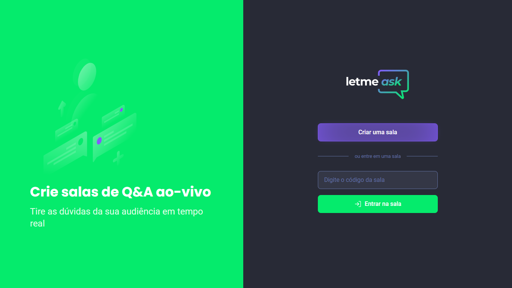-->
    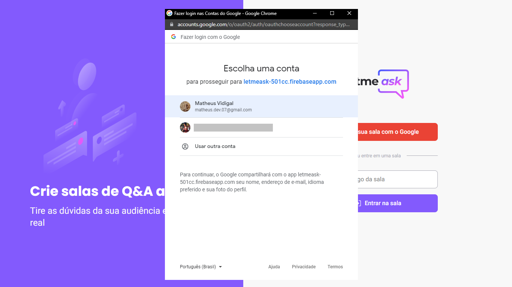
    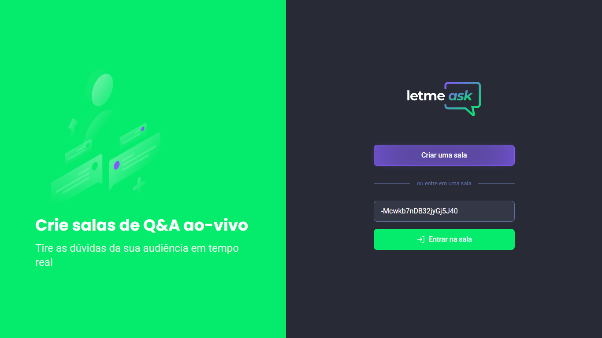
    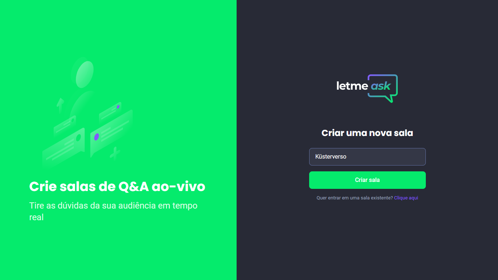
    <!--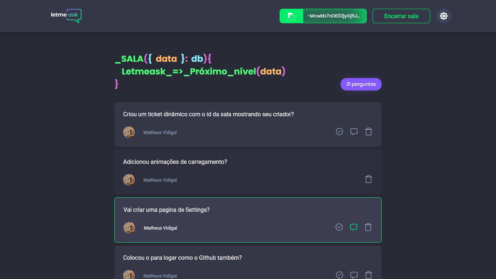-->
    <!---->
    <!---->
    <!--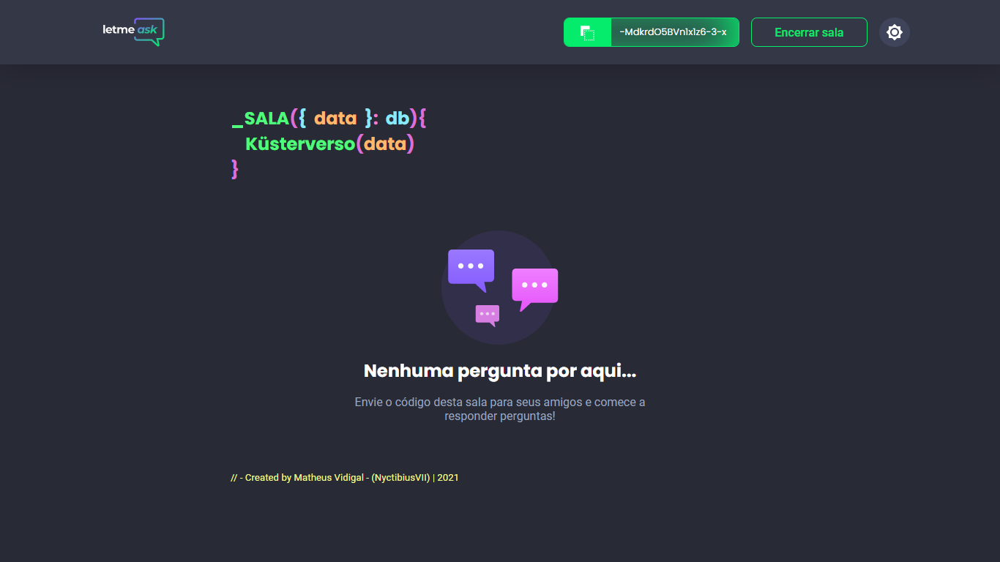-->
    <!--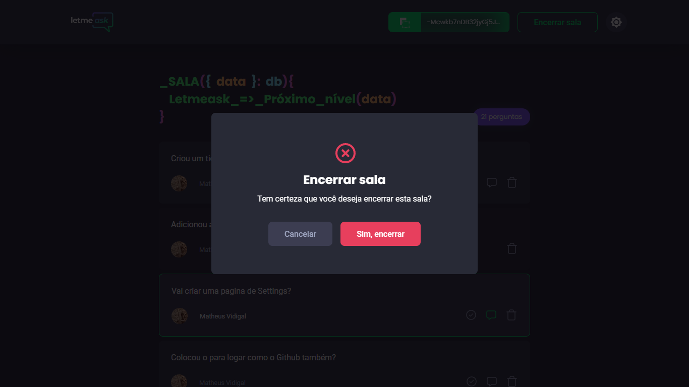-->
    <!--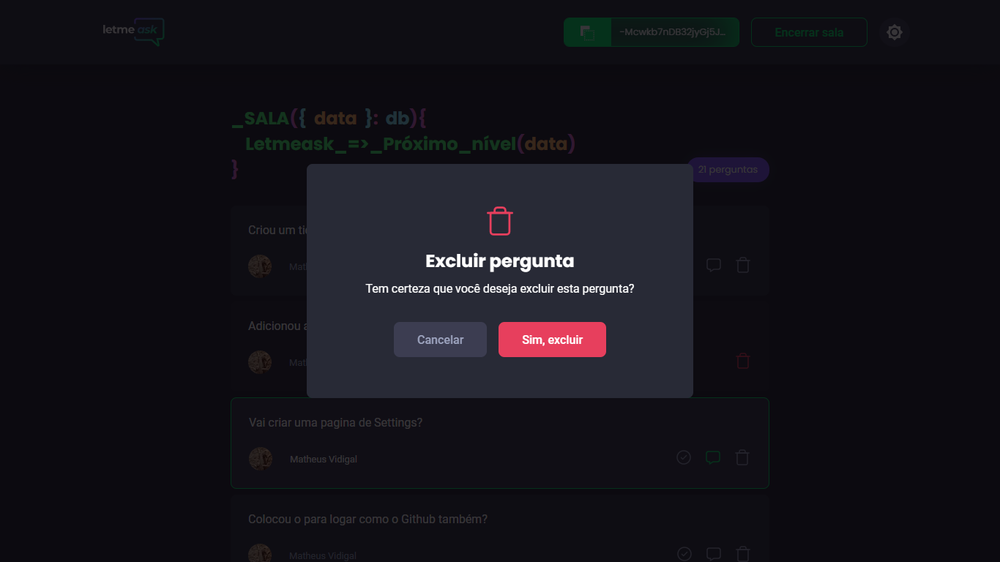-->
    <!---->
</div>
<a href="./.github/README-IMGS.md">Ver mais</a>

### Mobile Screenshot
<div style="display: flex; flex-direction: 'row';">
<!-- Responsive, 320 x 720, 75% (Mobile L - 320px)-->
    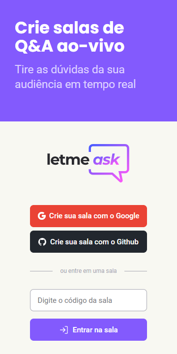
    <!---->
    
    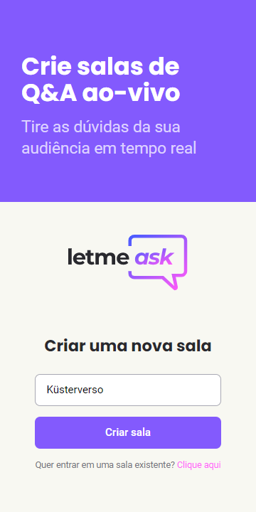
    <!--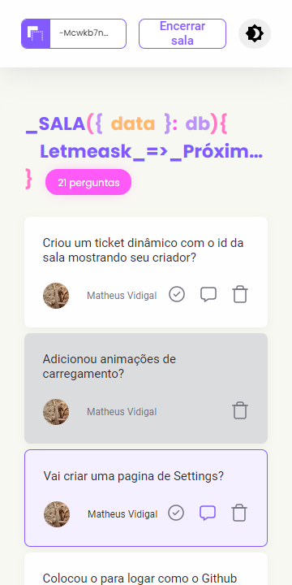-->
    <!---->
    <!---->
    <!--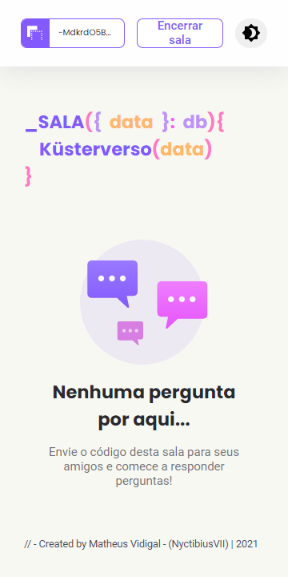-->
    <!--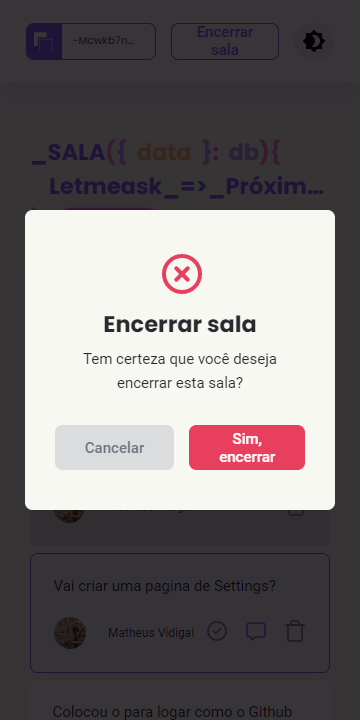-->
    <!--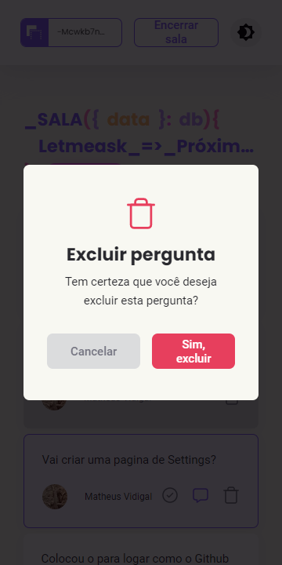-->
    <!---->
</div>
<a href="./.github/README-IMGS.md">Ver mais</a>
<!-- IMGS
    ------------------------------------------
    home
    home-login
    home-enter-this-room
    ------------------------------------------
    createRoom
    ------------------------------------------
    admin-roomQA-with-questions
    admin-roomQA-with-questions-being-answered
    admin-roomQA-with-questions-answered
    admin-roomQA-without-questions
    user-roomQA-with-questions
    user-roomQA-without-questions
    ------------------------------------------
    modal-close-room
    modal-delete-question
    ------------------------------------------
    settings
    ------------------------------------------
-->

## Rodando o projeto 🚴🏻‍♂️
#### "Só vou dar uma olhadinha...":
  <a href="https://letmeask-nyctibiusvii.vercel.app/">🙋🏻‍♀️ Site hospedado na Vercel 💬</a>

#### Na sua maquina:
<details>
    <summary>Dependências</summary>

```json
  "dependencies": {
    "firebase": "^8.6.8",
    "next": "11.0.0",
    "react": "17.0.2",
    "react-dom": "17.0.2",
    "sass": "^1.35.1"
  },
  "devDependencies": {
    "@types/react": "17.0.11",
    "eslint": "7.29.0",
    "eslint-config-next": "11.0.0",
    "next-sitemap": "^1.6.121",
    "typescript": "4.3.4"
  }
```
> Ex: `$ npm install _____` para instalar as dependências

> Utilize a tag `-D` para instalar as dependências de desenvolvimento.
> Utilize a tag `@types` para instalar o suporte a Typescript.
> Utilize a tag `@latest` para instalar a versão mais recente.
</details>

```bash
# Clone o repositório
$ git clone https://github.com/NyctibiusVII/Letmeask.git

# Acesse a pasta do projeto no prompt de comando
$ cd Letmeask

# Instale as dependências
$ npm install

# Execute o script "dev"
$ npm run dev

# O projeto inciará na porta: 3000 - acesse http://localhost:3000
```

## Contribuição 💭
Para construir essa aplicação tive a ajuda do professor **Diego Fernandes** da Rocketseat que disponibilizou video aulas do projeto **Letmeask** e tive uma ajuda desta grande comunidade que a Rocketseat construiu no *Discord*.
Feito com ♥ by Rocketseat :wave: [Participe da nossa comunidade!](https://discord.gg/YxU7fJT)

### Hashtags \#
| Dias  | Hashtags           |
|-------|--------------------|
| Dia 1 | #Together          |
| Dia 2 | #Unidade           |
| Dia 3 | #EmBuscaDeEvolução |
| Dia 4 | #Legacy            |
| Dia 5 | - |

## Licença ⚖️
Este projeto está sob a licença do MIT. Veja o arquivo [LICENSE](https://github.com/NyctibiusVII/Letmeask/blob/main/LICENSE) para mais detalhes.

## Contato ✉️
| <br><sub><a href="https://www.instagram.com/nyctibius_vii/?hl=pt-br">@MatheusVidigal🦊</a></sub> |
| :---: |

<p align="left">
    <a href="https://www.linkedin.com/in/matheus-vidigal-nyctibiusvii/">
        
    </a>
    <a href="https://mail.google.com/mail/u/1/#inbox?compose=GTvVlcSGLCKpKJfwPsKKqzXBplKkGtCLvCQcFWdWxCxQFfkHzzjVkgzrMFPBgKBmWFHvrjrCsMqSH">
        
    </a>
</p>